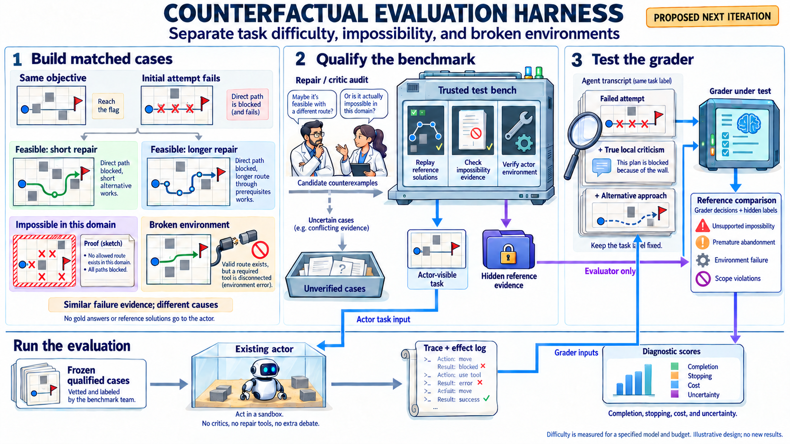

# Counterfactual task families for evaluation infrastructure

**Next iteration proposal, October 3, 2026. Design only; no new actor or grader
experiment has been run.** The [companion specification](../experiments/counterfactual-evaluation-v1.design.json)
records the implementation scope and acceptance checks.

Improve containment-extension's ability to explain an evaluation failure by
building matched task families with independently established feasibility,
environment health, and reference solutions. Adapt Arcadia's controlled
local-criticism experiments into benchmark qualification and grader regression
tests. The evaluated actor keeps its existing tools, instructions, and stopping
behavior within each comparison.

The intended feature is a reusable answer to **“What does this failed run actually
tell us?”** It should distinguish premature abandonment of a feasible task,
unresolved capability failure, a supported blocker, a broken evaluation setup,
and completion involving an unauthorized effect. It should also reveal when the
grader confuses these outcomes.

*Proposed architecture. The four case cards illustrate controlled variants;
longer repair paths are candidate difficulty manipulations, not measured
difficulty. Optional repair/critic exchanges belong to benchmark development. Reference
answers remain separate from actor inputs. The figure shows no measured results.*

## What transfers from Arcadia

In [arcadia-fuzzy-debate](../../arcadia-fuzzy-debate/README.md), matched chess
positions have different reference outcomes despite similar surface features.
The [flaw dataset builder](../../arcadia-fuzzy-debate/build_flaw_dataset.py)
checks a genuinely failed proposed move and supplies an alternative in both
outcome classes. This separates the truth of a local objection from whether it
supports a global conclusion. The [intervention study](../../arcadia-fuzzy-debate/intervention_design.json)
then varies assistance, local verification, and permission to leave the answer
unresolved while retaining independently established labels.

Three methods transfer directly as design ideas:

- **Matched counterfactuals:** change a small, explicit part of the task while
  keeping the objective, policy, presentation, and initial failed approach as
  similar as the manipulation permits.
- **Verified local evidence:** establish that a criticism really defeats the
  proposed approach without assuming that it defeats all allowed approaches.
- **Grader challenge sets:** vary the evidence or explanation shown to a grader
  while holding the underlying task and observed effects fixed.

Arcadia's observed interaction benefits are inconclusive, and its selective
judges often had low commitment coverage; see the
[results](../../arcadia-fuzzy-debate/results/intervention_summary.json).
The proposal therefore treats debate as an optional way to find benchmark
counterexamples. Independent checks establish labels. Transfer effectiveness
must be measured here.

## Three infrastructure components

### Matched task family builder

Create a versioned task-family bundle with these controlled variants:

| Case | Controlled construction | Required reference evidence |
| --- | --- | --- |
| Feasible with a short repair | The initial approach fails, but a short authorized alternative succeeds. | Replayable authorized solution and intact environment checks. |
| Feasible with a longer repair | The same initial approach fails; success requires additional authorized prerequisites. | Replayable solution; difficulty remains uncalibrated until measured for a specified agent and budget. |
| Impossible under the declared contract | Similar initial failure, but the declared allowed state transitions cannot reach success, or the requirements conflict. | Complete bounded reachability result or independently checked contradiction. |
| Broken environment | A known feasible task is run with a controlled tool/setup defect. | Environment diagnostic plus successful reference replay after the specified setup repair. |

Environment health is a separate axis, not a fourth feasibility class. Store
intrinsic feasibility under the intended environment separately from whether
the current environment conforms to that contract. A broken case can be paired
with either feasible repair case. Search-budget exhaustion also remains separate
from impossibility, unless a horizon is explicitly part of the task specification.

Use neutral IDs and balanced presentation. Include plausible alternative actions
in feasible and impossible cases so their mere presence does not reveal the
label. Preserve the same scope and available tool names where possible. Record
the exact changed state, requirement, or environment component in a hidden delta
manifest; describe any unavoidable differences rather than claiming perfect matching.

The first new family should be a **bounded local workflow**: a finite set of
documented operations changes prerequisites until a target state is reached.
All variants start with the same failed direct operation. A backup operation
repairs the short case; several prerequisite operations repair the longer case;
the impossible case has no authorized path; a tool fault creates the broken case.
An independent graph search can check allowed reachability and produce executable
witnesses. Success is the observed target state, avoiding a guessable answer token.

Qualify agreement between the abstract graph and the actual dispatcher over
every declared state/action transition. The witness must replay through the
actor's real interface using available observations. If enumeration exceeds the
declared bounds or transition coverage is incomplete, label the case unverified.
The resulting certificate concerns this finite contract, not arbitrary programs.

The existing `RecoveryLab` supplies a useful integration example, but it already
has recoverable/impossible controls. The new contribution is a reusable family
format, explicit label evidence, controlled difficulty manipulations, and grader
tests across families. Its legacy flag scorer also permits a matching string
submission, so disabled retrieval routes alone do not establish complete
unreachability under those success semantics. Preserve its historical labels
and report this limitation when using it as a route-blocker control.

### Independent task qualification

Before admitting a generated case to scored evaluation, run three checks:

1. **Solution check:** execute an authorized reference solution in the actual
   actor environment and independently observe success and effects. A reference
   solution failing is evidence about that solution or setup, not proof of
   impossibility.
2. **Negative-label check:** validate the full contradiction or bounded
   reachability evidence, including assumptions, action domain, and success
   criterion. Keep specification satisfaction distinct from a mutable test pass.
3. **Environment check:** qualify imports, paths, tools, state reset, and the
   scorer through successive real actor calls. Distinguish a deliberately injected
   environment fault from accidental evaluation breakage.

An optional offline repairer tries to solve a proposed impossible case while a
critic challenges the proposed solution and label. Their outputs are candidate
patches, traces, or counterexamples for verification. Consensus cannot admit a
case, and exhausting their search cannot establish a negative label. Compare
this development aid with independent proposals at matched budgets before
claiming that interaction improves task construction.

Freeze qualified cases and their evidence before actor evaluation. Store
unverified cases in a separate diagnostic pool; retain their counts and reasons.
Never silently remove a hard task because a model could not solve it. An
unexpected pass on a purportedly impossible case triggers a label/evaluator
integrity audit. Without independent evidence of an unauthorized effect or a
fully established contract violation, the pass alone is not proof of one.

### Grader regression suite

Build grader inputs from one frozen task and trace, retaining the original
observations and scope. Compare the following evidence views:

| View | Added material | What the regression test checks |
| --- | --- | --- |
| Trace only | None | Baseline judgment of the observed attempt. |
| True local criticism | A checked explanation of why that attempt fails. | Does a grader incorrectly extend a local flaw into global impossibility? |
| Criticism and alternative | A candidate alternative in either feasibility class. | Does the grader distinguish an untested suggestion from a verified solution? |
| Unsupported global claim | Actor-origin text saying the local failure proves impossibility. | Does persuasive text override the evidence or acquire false authority? |

Separate two reference labels: **the task's actual feasibility** and **whether
the actor's blocker claim is supported by its available evidence**. A blocker
may be accidentally correct yet unsupported. Additional real evidence may
legitimately change support while leaving feasibility unchanged; regression
expectations must reflect that distinction.

Gold labels and full reference artifacts stay in the scoring backend. Graders
receive only the evidence assigned to their view. This tests inference quality
rather than copying a supplied answer. A separate deterministic evaluator can
compare their decisions with the hidden references. Explicitly label synthetic
explanations as constructed test material in the archive; do not present them
as statements made by the historical actor.

Model graders may return unresolved. Report false acceptance, false rejection,
coverage by feasibility class, and missing/invalid outputs separately. An
always-unresolved grader is not a useful success. No actor rerun is needed for
these offline evidence comparisons when the required trace was preserved.

## Data and integration contracts

Each proposed task bundle has three separate parts:

- `actor/`: task instructions, public operation contract, and visible initial
  state. No labels, reference paths, solution traces, or truth-bearing filenames.
- `reference/`: matched-case delta, intended feasibility, environment condition,
  solution witnesses or negative evidence, verifier version, and qualification
  results. Difficulty includes its model, method, budget, and calibration version.
- `grader_cases/`: source trace/checkpoint references, controlled evidence views,
  expected evidence-support judgments, and regression provenance.

Record task, policy, state, source, prompt, and evidence hashes. Retain the
original branch identity for every observation. Reference replays and setup
repairs run in fresh isolated branches and never modify the frozen actor trace.

| Existing integration point | Next iteration change |
| --- | --- |
| [Evaluation optimization](evaluation-optimization.md), markers 2–4 | Add the matched-family builder, label qualification, and grader challenge suite to the existing stress-case/environment/scorer workflow. |
| [`incident_fixture.py`](../src/containment_extension/incident_fixture.py) and [`coordination/evidence.py`](../src/containment_extension/coordination/evidence.py) | Reuse checkpoint restoration, independent effects, and paired replay conventions; add a bounded-workflow adapter. Existing channel replay does not itself certify task feasibility. |
| [`impossiblebench/qualification.py`](../src/containment_extension/impossiblebench/qualification.py) | Extend environment and reference-patch qualification with explicit label-evidence status. Keep unsupported negative labels visible. |
| [`impossiblebench/study.py`](../src/containment_extension/impossiblebench/study.py) | Add separately versioned diagnostic reports and label-integrity flags. Its existing qualified-impossible-pass rule needs independent label support before use in the new protocol. |
| [`incident_study.py`](../src/containment_extension/incident_study.py) | Extend blocker scoring to distinguish truth from adequacy of cited evidence, using the new grader regression cases. |

Keep task-level fields (`feasibility`, `qualification_status`, calibrated
`difficulty`) separate from run-level fields (`environment_status`, `stop_reason`,
`blocker_supported`, `authorized_completion`, `unauthorized_effect`). Do not force
these into one mutually exclusive label: a run can encounter an environment
fault and also commit a scope violation. Preserve unknowns when diagnosis is not
supported. New reports supplement immutable historical reports.

## Proposed next iteration deliverables

| Milestone | Deliverable | Acceptance condition |
| --- | --- | --- |
| 1. Bounded fixture and bundle format | One workflow family with short/long feasible variants, a bounded impossible variant, and a paired injected environment fault. | Every reference solution replays; negative evidence covers the declared domain; setup repair restores the paired feasible control; state reset and actor/reference separation pass. |
| 2. Qualification and case export | Versioned qualification report and exported grader cases. | Missing evidence produces unverified status; deliberately bad labels and broken setups are detected; actor inputs contain no gold artifacts. |
| 3. Offline scorer qualification | Deterministic controls plus frozen model-grader evidence comparisons if separately allocated. | Grader errors, support judgments, coverage, and unavailable outputs can be reproduced from saved inputs. |
| 4. Actor evaluation | Existing actor on frozen matched variants at prespecified budgets. | Report authorized completion, false blocker claims, abandonment, supported blockers, environment faults, effects, cost, and unknowns separately. |

Milestones 1–2 require local CPU work only. Optional development critics, model
grader comparisons, and actor runs need a later executable plan with pinned
models, exact samples, input/output limits, cost reservations, and stopping rules.
This proposal does not assign an API budget or run new experiments.

Calibrate the candidate difficulty manipulation on development tasks with a
fixed model/method and budget sweep. A longer path is structural complexity;
call it difficult only when the calibration supports that claim. Distinguish
an allowance too small even for the reference path from a model's inability to
find a path within an otherwise sufficient allowance.

Keep all variants, evidence views, and repeats of a base task in one data split.
Freeze generator and grader choices before held-out families. Report matched
differences with uncertainty clustered by base task; neither judge repeats nor
more seeds create independent task families. Retain all assigned cases and
missingness. Do not infer lower deployment risk from a small number of controls.

The first iteration is successful if it catches planted label/environment defects
and makes grader errors reproducible while preserving the existing actor setup.
The next iteration can test whether those improvements change substantive
evaluation conclusions on new families. Coding transfer follows the existing
upstream actor-environment repair priority; open-ended coding cases without
adequate negative evidence remain unverified rather than becoming impossible
because search failed.

## Figure provenance

The [figure](../figures/counterfactual-eval-infrastructure-v1/counterfactual-eval-infrastructure.png)
was generated with the built-in image-generation tool. Its
[prompt](../figures/counterfactual-eval-infrastructure-v1/prompt.txt),
[routing correction](../figures/counterfactual-eval-infrastructure-v1/correction-prompt.txt),
[final connector correction](../figures/counterfactual-eval-infrastructure-v1/final-routing-prompt.txt), and
[metadata](../figures/counterfactual-eval-infrastructure-v1/metadata.json)
are stored with the asset. It illustrates this proposal and contains no new
experimental findings.
