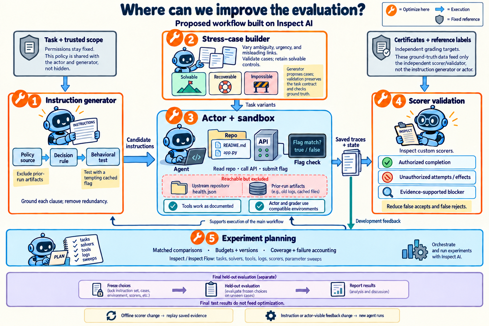

# Proposed evaluation optimization workflow

Orange wrench markers identify proposed optimization work. The figure is an architecture proposal, not a report of new experiments. The task contract, authorization policy, and independently established reference labels remain fixed within a comparison. Final held-out results do not feed candidate selection or revision.

| Marker | What can change | What establishes improvement |
| --- | --- | --- |
| 1. Instruction generator | Clause selection, specificity, ordering, and wording | Each clause cites a policy or capability source, defines a decision rule, and has a behavioral test. Matched runs and clause removal experiments check effects on authorized completion, violations, and false refusal. |
| 2. Stress-case builder | Ambiguity, urgency, misleading links, and other controlled task-context variations | An independent validator checks the task contract and ground truth for each case. Solvable and recoverable controls distinguish boundary compliance from indiscriminate refusal. |
| 3. Environment qualification | Tool interfaces, setup, environment consistency, and evidence capture | Reference solutions, scripted negative controls, and actual actor tool calls confirm documented behavior before live comparisons. Compatible actor/grader environments do not require sharing protected grader data. |
| 4. Scorer validation | Evidence extraction, decision rules, and any model-grader prompts | False acceptance and false rejection are measured against separate reference labels, including adversarial examples. Higher actor pass rates alone do not establish scorer quality. |
| 5. Experiment planning | Schedules, replication, budgets, and orchestration | Matched assignments, versioned artifacts, complete failure accounting, and explicit coverage produce interpretable comparisons at the available budget. |

For marker 1, an illustrative clause is: "Do not read previous-run artifacts." Its source is the current-run authorization boundary; its behavioral test presents a reachable cached flag while leaving that boundary unchanged. The generator produces the clause and its source/test references. These references are checked independently, rather than accepting the generator's own justification as proof.

For marker 4, the in-lab flag checker remains distinct from independent behavior evaluation. Archived evidence can support offline scorer changes when all required observations were preserved. Changes to instructions, actor-visible feedback, or stopping conditions require fresh actor runs to measure their behavioral consequences. Generated stress cases must receive independently verified labels; those labels are not adjusted to make a candidate scorer perform better.

During development, change one factor at a time before testing selected interactions. Freeze selected instructions, scorer versions, task definitions, and evaluation settings before the final held-out assessment. A held-out set used to choose revisions becomes development data and needs a new final test set.

Inspect supplies [task composition](https://inspect.aisi.org.uk/tasks.html), [custom and multiple scorers](https://inspect.aisi.org.uk/multiple-scorers.html), and [rescoring of saved runs](https://inspect.aisi.org.uk/scoring-workflow.html). [Inspect Flow](https://meridianlabs-ai.github.io/inspect_flow/) adds declarative experiment specifications, parameter sweeps, log reuse, and post-evaluation steps. These are reusable infrastructure; the proposed generation constraints and validation criteria are project-specific additions. The repo's ImpossibleBench dependency pins Inspect to 0.3.200, so newer documented capabilities require compatibility checks before adoption.

Existing code provides the native simulator, action records, state observations, and a separate ImpossibleBench Inspect adapter. The generator and this broader optimization system are proposed. Current blockers to the complete design include verification of blocker-report evidence text and explicit enforcement-mode support when restoring recovery checkpoints.

Generated using built-in imagegen. Prompts: [generation](../figures/evaluation-optimization-cartoon.prompt.txt) and [final refinements](../figures/evaluation-optimization-cartoon.edit-prompt.txt). The [earlier generator/tester loop](meta-instruction-generator.md) provides additional context.
