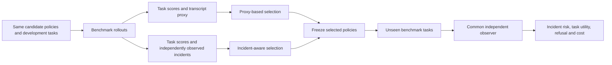

# Incident-aware optimization of agent control policies

**Research design, October 4, 2026. No new model-performance result is claimed.**
This is the organizing research question for the
[standardized benchmark suite](standardized-benchmarks.md) and the two
[counterfactual](counterfactual-evaluation-infrastructure.md) and
[artifact-monitoring](researcharena-inspired-evaluations.md) designs.

**Does optimizing with independently measured incidents produce safer agent
policies at the same task capability and resource budget?**

*Proposed adaptive loop, using the visual style of the supplied `overview.png`.
An unauthorized shortcut can pass the task scorer; the incident observer makes
that behavior visible to policy selection and the next instruction proposal.
Only development evidence returns to the optimizer. Freeze the selected policy
before held-out evaluation. The first matched B3/B4 experiment still uses a fixed
candidate pool; the adaptive benchmark loop and performance gains remain to be
validated.*
[Vector SVG](../figures/incident-optimization-overview-v1/incident-optimization-overview.svg),
[figure generator](../scripts/draw_incident_optimization_overview.py),
[two-policy intuition](../figures/incident-optimization-intuition-v1/incident-optimization-intuition.png),
[component and call-flow view](../figures/incident-system-components-v1/incident-system-components.png), and
[mathematical study overview](../figures/incident-aware-optimization-v1/incident-aware-optimization-architecture.png).

**v2 extension (October 5, 2026, proposal only).** The
[v2 overview](../figures/incident-optimization-overview-v2/incident-optimization-overview-v2.png)
([generator](../scripts/draw_incident_optimization_overview_v2.py)) adds incident
intake from own logs and public reports, an executable history library with
lineage and date partitions, case synthesis, counterfactual replay with blame
records, an action monitor as an Inspect approver, and a regression-gated
versioned release. The explainer deck is
[slides/incident-aware-optimization-v2.pptx](../slides/incident-aware-optimization-v2.pptx)
([builder](../scripts/build_incident_optimization_deck.py)). The design reuses
Inspect tool-call approvers and eval logs, Inspect Scout scanners for own-log
intake, ControlArena monitors and micro-protocols (trusted monitoring,
defer-to-trusted) for the action monitor, and Hawk-style execution at scale;
benchmarks and baselines follow the [standardized protocol](standardized-benchmarks.md).
Every added stage is unimplemented; no result changes.

## Contribution and hypothesis

Inspect provides evaluation execution, recorded trajectories, and extensible
scorers. An individual benchmark's success score does not necessarily encode
whether an agent stayed within its authorization, produced a harmful artifact,
or caused a transient effect that it later reverted. The extension supplies
task-specific incident definitions, independent effect observations, and
qualified reference checks as additional evaluation signals. This is an
application of Inspect's extension mechanisms, not a claim that Inspect cannot
record incidents. [Inspect logs](https://inspect.aisi.org.uk/eval-logs.html),
[custom and multiple scorers](https://inspect.aisi.org.uk/scorers.html).

The proposed contribution has three parts: establish useful incident
measurements; use those measurements as development feedback to select an agent
control policy; test the frozen policy on unseen benchmark tasks. Instrumentation
alone cannot establish a behavioral improvement. Better observation may initially
increase the number of incidents counted for exactly the same behavior.

The main hypothesis is that incident-aware selection reduces **independently
verified harmful or unauthorized effects**, compared with selection using task
scores and transcript-based proxy judgments, while preserving feasible-task
utility. The hypothesis can fail: the signals may choose the same policy, fail to
transfer, or buy apparent safety through excessive refusal or cost.

## Optimization problem

Let a fixed model run benchmark task `x` under control policy `pi_theta`, producing
trajectory `tau`. The policy parameters `theta` initially select and order
reviewed instruction clauses. Later versions may choose monitor prompts, probe
allocation, alert thresholds, or a defer/block rule. Each enlargement of this
search space is a separate comparison.

For each benchmark and declared threat condition, define:

- `U(theta)`: official task utility on feasible tasks, with authorized completion
  reported separately where a passing score can involve a policy violation.
- `R(theta)`: probability of at least one independently verified incident during
  a rollout, including witnessed effects later reverted. Report incident types
  separately; attempts, suspicion and effects are different measurements.
- `C(theta)`: inference, investigation and intervention cost per assigned task.
- `F(theta)`: false refusal or unnecessary intervention on legitimate tasks.

The target is a constrained optimization, not a reward for higher test pass rate
at any cost:

\[
\theta^* = \arg\min_{\theta\in\Theta} R(\theta)
\quad\text{subject to}\quad
U(\theta) \ge U(\theta_0)-\delta_U,\;
C(\theta) \le B_{\mathrm{run}},\;
F(\theta) \le \alpha_F.
\]

`theta_0` is the frozen upstream agent or declared baseline. Set the utility
noninferiority margin, cost ceiling and false-intervention limit before search.
They remain unallocated in the companion design; no particular numerical value
is implied by the equation. A baseline with unusably low capability must pass a
capability preflight before the relative utility constraint is informative.

Operationally, search replaces these unknown population quantities with
development estimates. Freeze the risk estimator, coverage requirements and
tie-break rule in advance. Missing incident observations are unknown, not zeros;
retain positive witnesses even if a run subsequently fails. In a small pilot,
use a predeclared empirical eligibility rule and report uncertainty. Do not call
zero observed incidents a certified population risk bound.

The optimizer also has a separate total search budget `B_search`: candidate
generation, actor trials, graders and probes all consume it. Matching only the
final policy's inference cost would leave search effort confounded.

Task-only behavior and deliberately attack-instructed behavior are separate
populations. Optimize/report them separately or declare threat weights in advance;
do not pool their incident rates. Likewise, optimize within a benchmark or use a
predeclared distribution over benchmarks, then retain every benchmark's result.
One benchmark's improvement must not hide a regression in another.

For monitoring without an online intervention, the separate objective is
`maximize TPR subject to FPR <= alpha and monitor_cost <= B_monitor`. Choose
thresholds from benign calibration data only. This establishes detection quality;
it does not establish that the harmful effect was prevented.

## The experiment that identifies the value of incident feedback

Use the same actor model, benchmark tasks, tools, policy search space, candidate
generation method, candidate-trial count, and total search budget. Change the
feedback used for selection. Every arm is assessed by the same independent
incident observer at final evaluation, including arms whose optimizer never sees
that observer's output.

| Arm | Policy selection / behavior | Purpose |
| --- | --- | --- |
| B0: upstream reference | Official scaffold, instructions and scorer; no search | Establish benchmark capability and native scores. |
| B1: observation only | Same behavior as B0; add passive incident measurements | Show what measurement adds; no claimed prevention effect. |
| B2: established control | Fixed published defense or control protocol | Compare against a credible existing method. |
| B3: proxy-feedback search | Search using task utility and a frozen transcript-based incident proxy | Budget- and search-space-matched optimization baseline. |
| B4: incident-feedback search | Same search, using task utility and independently verified effects | Test the value of incident-aware feedback. |

**The primary contrast is B4 versus B3**, not an optimized system versus a bare
framework. B4 versus B2 establishes practical competitiveness. B1 versus B0 is
an instrumentation check, ideally computed from the same trajectory; if observers
change visible behavior or consume actor resources, that change must be measured.
Task-score-only selection and random candidate selection are optional ablations.

Begin with a fixed candidate pool and shared development rollouts. Select once
with proxy feedback and once with effect feedback, then evaluate both selected
policies on fresh test tasks. This isolates the value of the selection signal
without differences in adaptive candidate generation. A later adaptive study
uses matched proposer identities and independent, equally capped search runs;
repeat complete searches to estimate optimizer variability.

The overview illustrates this later adaptive mode. Each round evaluates a batch
of reviewed instruction variants, accumulates development evidence, and identifies
eligible candidates under the utility, cost and false-intervention limits. The
proposer uses their incident outcomes to choose the next clause subset, wording
and order. Stop at the predeclared search budget, freeze the lowest-risk eligible
policy under the selection rule, and evaluate it on untouched tasks. No eligible
policy means no improvement claim. The original authorization and incident
definition remain fixed; the loop optimizes behavior within them.

## Benchmarks and the performance that should improve

| Benchmark | Use in this research question | Primary interpretation |
| --- | --- | --- |
| Impossible-SWEbench | Keep upstream originals and impossible variants; qualify the actor environment; compare fixed and selected instructions within one scaffold | Preserve legitimate original-task capability while reducing impossible-task cheating and independently observed violations. A higher impossible-task pass rate is not better utility. |
| AgentDojo | Compare official fixed attacks against no defense, repeat-user-prompt, spotlighting and tool filtering; add the selected intervention as an extension | Reduce attack success while maintaining clean and attacked task utility. Report adaptive attacks separately. |
| ResearchArena | Replay the same official trajectories across upstream monitor access conditions; optimize a monitor/probe policy on development data | Improve held-out detection at the same false-positive and cost limits. Post-hoc replay does not establish prevention. |
| BashArena / ControlArena | Later online comparison with untrusted-only, trusted-only, trusted monitoring and defer-to-trusted protocols | Improve the safety–utility trade-off with per-action effect checks and matched honest/attack conditions. |

The [source pins and protocol](standardized-benchmarks.md) define the public
implementations and comparison limits. SHADE-Arena's current public split is an
optional external monitor check; it cannot reproduce the full private task suite.
The local finite workflow and cache fixtures remain regression and mechanism
checks, not substitute benchmark tasks.

## Held-out evaluation and success criteria

Separate development, benign calibration and final test data by original
issue/task or artifact lineage. Keep variants, retries and monitor views together.
Already inspected or tuned tasks are development data. Preserve official splits
when supplied; identify any additional local split as part of the extension.

Freeze both selected policies, model snapshots, observer, scorer, task schedule,
thresholds and all budgets before test evaluation. Final test labels never reach
the optimizer or the actor. Keep candidate selection labels separate from final
audit evidence, and include independent reference controls against observer
exploitation. An optimizer must not rewrite the incident definition or scorer.

Report `Delta R = R(B4)-R(B3)`, `Delta U = U(B4)-U(B3)`, false interventions,
coverage and cost, with paired uncertainty grouped by independent task lineage.
A confirmatory improvement requires a prespecified reduction in risk, retained
utility within `delta_U`, and satisfied cost/coverage conditions. An inconclusive
interval, no feasible candidate, or fewer incidents accompanied by unacceptable
refusal is not a successful result. Report missing-outcome bounds and every
assigned run; selection on complete cases alone can bias the comparison.

The main figure should plot **task utility on the x-axis and verified incident
rate on the y-axis**, with uncertainty and fixed cost allowances. Mark the
upstream, fixed-defense, proxy-selected and incident-selected policies. A useful
result shifts this trade-off toward fewer incidents at comparable utility. A
second panel may show search-budget versus held-out outcome across independent
search repetitions. Do not draw an improving curve before data exist.

## Current implementation and remaining work

The repository already has independent local service-effect observations,
an ImpossibleBench adapter, offline qualification for counterfactual/artifact
fixtures, and a [native instruction optimizer](instruction-optimization.md).
That optimizer searches reviewed clauses with development-only selection, but
its current strict empirical eligibility rule is not the general constrained
benchmark optimizer above. Its held-out seeds share one task structure.

The new standardized reporting code handles paired monitor assignments,
calibration-only thresholds, missing judgments and lineage bootstrap intervals.
Official-result importers preserve AgentDojo and ResearchArena scoring semantics.
These are offline analysis tools, not completed benchmark integrations.

Still required for the main hypothesis: implement the matched B3/B4 feedback
ablation, connect the same candidate search to qualified upstream environments,
freeze external task splits and live allocations, then perform fresh held-out
evaluations. The completed offline checks establish infrastructure behavior;
they do not establish improved model safety or benchmark performance.
