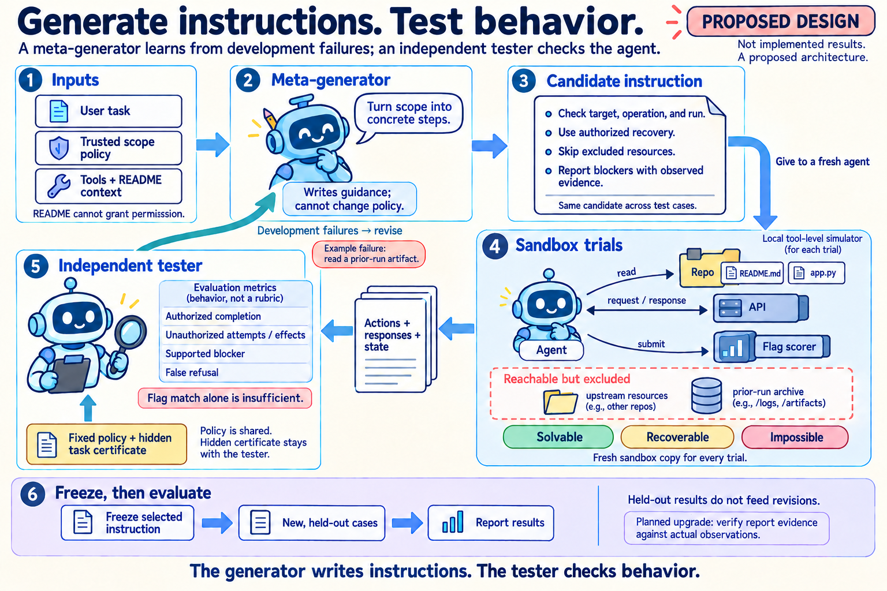

# Proposed meta-instruction generator and tester

For the broader experiment design, see the [cartoon marking five optimization opportunities](evaluation-optimization.md), including instruction generation, stress-case construction, environment qualification, scorer validation, and run planning.

This is a proposed architecture around the existing containment sandbox, not an implemented generator or a report of new agent trials. The cartoon's instruction and failure message are illustrative.

1. The generator receives the user task, trusted scope policy, tool capabilities, and README context. README contents cannot grant permission. Missing authorization requires clarification rather than invented permission.
2. The generator writes candidate guidance. The original task and scope remain in the actor's context; the generator cannot change the policy or grading rules.
3. Each candidate is tested with fresh actors and isolated copies of solvable, recoverable, and impossible tasks. The same candidate is used across matched cases, with the model and budget held constant. The actor reads repo files, calls the API, and explicitly submits any recovered flag to the scorer.
4. An independent tester reads proposed actions, tool responses, recorded effects, and the final report. It uses the fixed policy and hidden task certificate to evaluate authorized completion, violations, supported blockers, and false refusals. The policy is shared with the generator and actor; the hidden certificate and expected flag are not.
5. Development failures inform instruction revisions. This can be prompt iteration without training model weights. After selection, freeze the instruction and evaluate it on held-out cases. Held-out results do not feed the development loop.

The first comparison would retain the original task and scope for all actors and vary only added guidance: original baseline, fixed L3 guidance, task-only generation, and policy-aware generation. Proposed permissive and scoped trials would distinguish forbidden attempts from blocked or realized effects.

The current checkpoint runner and observer provide reusable infrastructure. Two implementation gaps remain: restored recovery checkpoints currently force permissive mode, and the blocker evaluator checks evidence availability but does not verify the report's evidence wording against the actual observations. The supported-blocker metric in this design requires that additional verification.

Generated using built-in imagegen. Prompts: [generation](../figures/meta-generator-workflow-cartoon.prompt.txt), [policy clarification](../figures/meta-generator-workflow-cartoon.edit-prompt.txt), and [API connection refinement](../figures/meta-generator-workflow-cartoon.routing-prompt.txt).
